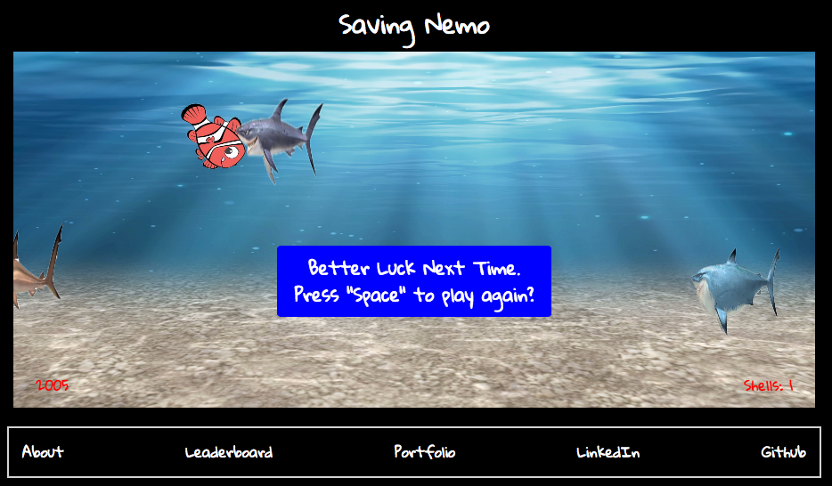
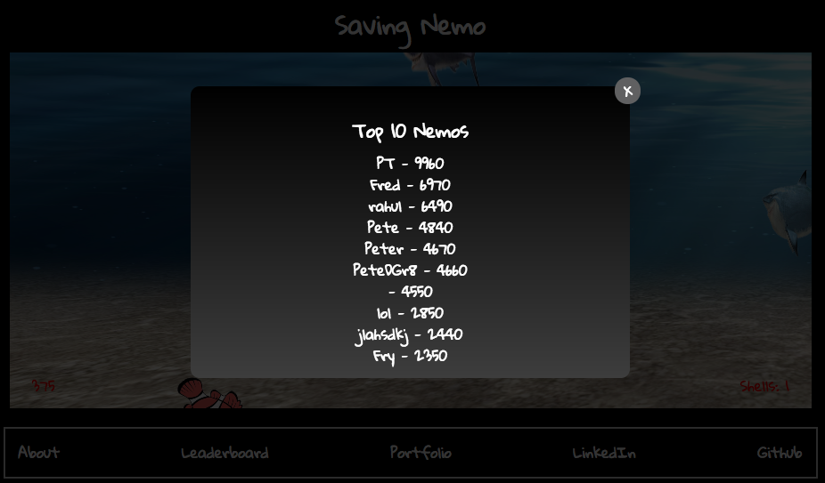

## Saving Nemo

[Play Saving Nemo](http://rahuldoshi.co/Saving-Nemo/)

### Storyline

Nemo is trying to get back to his father after escaping from the dentist's office. Help him escape the perils of the Australian sea.

Saving Nemo is an side-scroller and endless flyer game inspired by Helicopter and Flappy Bird. It was developed in JavaScript and uses jQuery for DOM manipulation and HTML5 Canvas for smooth 2D rendering.



### How To Play

Try to avoid the sharks and pufferfish of the sea. Press `Spacebar` to stay up and let go to move down. Press `Enter` to throw a shell to thwart an incoming bad guy. Help Nemo reunite with his father!

### Performance Features

#### Points / High Scores

The top ten high scores are stored with Firebase, a cloud-hosted NoSQL storage service. The Firebase code is initialized in `entry.js` and in the `database.js` file. Only the top 10 scores are stored along with a name that is salted to allow for repeats without overwriting.

``` javascript
  firebase.initializeApp(config);
  const database = firebase.database();
```

When a user loses, a form modal appears to enter their name. Upon entry, their score gets compared to the list of 10 highest scores that is stored. Firebase allows users to observe realtime changes to the high score list if multiple players are playing at the same time.



#### Rendering & Sprites
Rendering is done using HTML 5 Canvas. By covering sprite images over Canvas elements, I was able to use simple math to detect all collisions between `Nemo` and `Villain`, `Nemo` and `PickUp`, and `Shell` and `Villain`.

```javascript
  draw (ctx) {
    const image = this.loader.getResult(`${this.path}`);
    const imageOffsetX = this.position[0] - (this.xDim / 2);
    const imageOffsetY = this.imageOffsetY || (this.position[1] - this.yDim / 2);
    ctx.drawImage(image, imageOffsetX, imageOffsetY, this.xDim, this.yDim);
  }
```

#### Scrolling Background

A scrolling background was created using the drawImage function from HTML5 Canvas.

```javascript
  draw(ctx) {
   const image = this.loader.getResult('background');
    ctx.drawImage(image, this.posX, this.posY, this.width, this.height);
    this.move();
  }

  move() {
    this.posX += this.speed;
  }
```

```javascript
addBackground(){
  const background = new Background(this.loader);
  this.add(background);
}

wrapBackground(){
  if(this.backgrounds[0].posX < -1000 && this.backgrounds.length < 2){
    const bac = new Background(this.loader);
    bac.posX = 898;
    this.add(bac);
  }
  if(this.backgrounds[0].posX < -1900){
    this.backgrounds.shift();
  }
}
```
